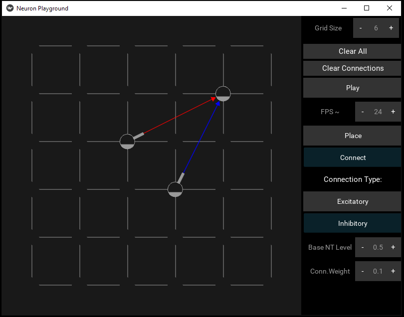
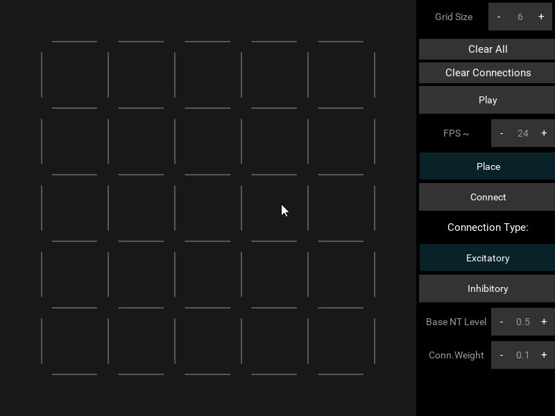

# NeuronPlayground
### A simple Kivy based interactive/realtime neuron playground.

# What is this thing ?

I built this neuron playground as a proof of concept for a bigger project back in 2016, the idea is to represent biological neurons and their basic interactions in real time.

# Some examples :

You can start by placing some neurons and hitting the play/stop button:

These neurons (the circles) have a base neurotransmitter level (the grey color fill) and slowly fill up until the discharge an action potential (the rate is fixed for simplicity)

# Running and packaging :

TK
