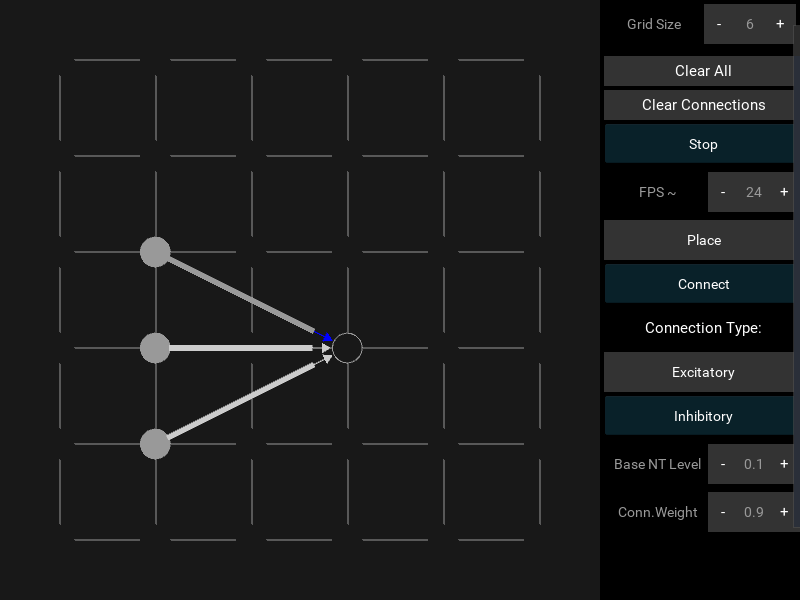
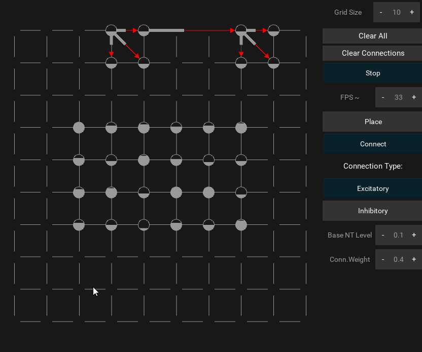

# NeuronPlayground
### A simple Kivy based interactive/realtime neuron playground.

# What is this thing ?

I built this neuron playground as a proof of concept for a bigger project back in 2019, the idea is to represent biological neurons and their basic interactions in real time.

# Basics :

You can start by placing some neurons and hitting the play/stop button:

These neurons (the circles) have a base neurotransmitter level (the grey color fill) and fill up until they discharge an action potential the rate is fixed for simplicity but in real life can vary.

You can then connect the neurons :

Connection weights can be changed per connection but are static (once more for simplicity), in real life they change based on the inputs (here we just have a basic oscillation per neuron ). connections propagate when the neurons fire and are indicated in white, the connection weight is also indicated by the thick part of the connecting line.

You can choose excitatory (red) or Inhibitory (blue) connections :

Here 3 inhibitory neurons synapse with another neuron that won't fire anymore, you can play with NT levels and connection weights

You can also change the grid size and global firing.

As mentioned this is not a real neuron emulator, but can help to show some concepts, here for instance are 26 neurons firing at random and 2 groups of 4 that get synchronized via excitatory connections.

Read more about neural synchronization here:

[Medium - Neural Synchronization in the brain][0aa42d10]

  [0aa42d10]: https://medium.com/@k3no/neural-synchronization-in-the-brain-e3c7b83b4309 "Neural Synchronization in the brain"

# Running and packaging :

Just install [Kivy][3ce5d694] and run the the src folder, haven't tested packaging as a standalone program, but you can follow this guide:

  [3ce5d694]: https://kivy.org/#home "Kivy."

[KIVY docs: Packaging your application][9c4bd77a]

  [9c4bd77a]: https://kivy.org/doc/stable/guide/packaging.html "KIVY docs: Packaging your application"

Let me know if you fork it, know of related projects or have some issues.

Cheers !
